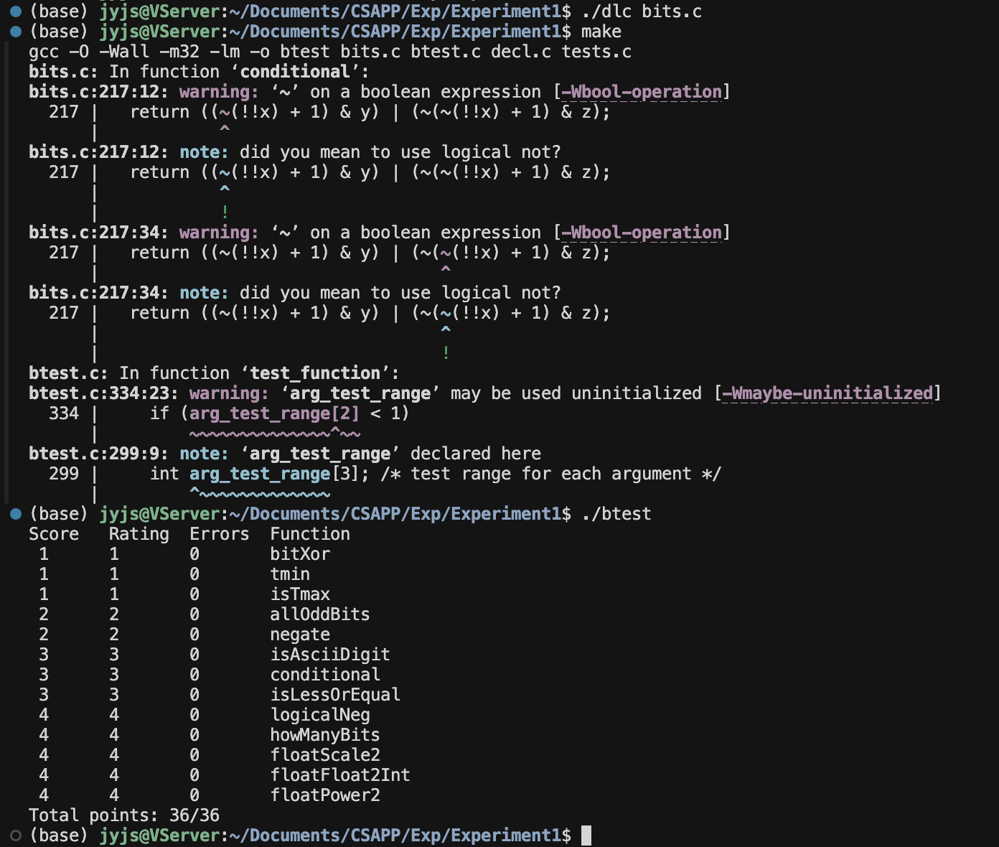

# Exp1

> SA25011052 刘睿博



## bitXor

```C
int bitXor(int x, int y) {
    return ~(~(x & ~y) & ~(~x & y));
}
```

即使用与门和非门实现一个异或门 $x\oplus y=(x\&\textasciitilde y)|(\textasciitilde x \&y)=...$（如上）

## tmin

```C
int tmin(void) {
    return 1 << 31;
}
```

二进制补码最小值即0x80000000

## isTmax

```C
int isTmax(int x) {
    int y = x + 1;
    return (!(~(x ^ y))) & !!(~x);
}
```

只有-1和INT_MAX满足$x\oplus(x+1)=0xffffffff$

再用!!~x排除-1即可

## allOddBits

```C
int allOddBits(int x) {
  int mask = 0x55;
  mask |= (mask << 16);
  mask |= (mask << 8);
  return !(((x | mask) ^ (~0)));
}
```

将不关心的偶数位与掩码0x55555555按位或后判断是否是0xffffffff即可

## negate

```C
int negate(int x) {
  return ~x+1;
}
```

二进制补码取负数即取反加一

## **isAsciiDigit**

```C
int isAsciiDigit(int x) {
  return !((x + ((~0x30) +1 )) >> 31) & 
           !((0x39 + ((~x) + 1)) >> 31);
}
```

目的是判断`x<=0x39`和`x>=0x30`两个不等式是否成立，做差后直接判断符号为是否为0即可

## **conditional**

```C
int conditional(int x, int y, int z) {
  return ((~(!!x) + 1) & y) | (~(~(!!x) + 1) & z);
}
```

通过`(~(!!x) + 1)`构造出0x0以及0xffffffff的掩码，与yz按位与后再按位或即可

## **isLessOrEqual**

```C
int isLessOrEqual(int x, int y) {
    int mask = (1 << 31) ^ (~0);
    int x_ = x & mask;
    int y_ = y & mask;
    int x_y = x_ + (~y_ + 1);
    int x_sign = x >> 31;
    int y_sign = y >> 31;
    int judge_a = (x_sign ^ y_sign) & !!x_sign;
    int judge_b = ~(x_sign ^ y_sign) & (!!((x_y >> 31)) | !(x_y));
    return judge_a | judge_b;
}
```

首先看能否根据符号位判断出x与y的大小关系，否则根据x y之差的符号位与x y的符号位判断出他们的大小关系

## **logicalNeg**

```C
int logicalNeg(int x) {
  return ((x | (~x + 1)) >> 31) + 1;
}
```

注意到只有0和INT_MIN 进行`(x | (~x + 1)`运算后是本身，其余均为0xffffffff，根据符号位即可区分0和其他数

## **howManyBits**

```C
int howManyBits(int x) {
  int sign = x >> 31;
  int temp = x ^ sign;
  int bit16, bit8, bit4, bit2, bit1;
  bit16 = (!!(temp >> 16)) << 4;
  temp = temp >> bit16;
  bit8 = (!!(temp >> 8)) << 3;
  temp = temp >> bit8;
  bit4 = (!!(temp >> 4)) << 2;
  temp = temp >> bit4;
  bit2 = (!!(temp >> 2)) << 1;
  temp = temp >> bit2;
  bit1 = (!!(temp >> 1));
  temp = temp >> bit1;
  return bit16 + bit8 + bit4 + bit2 + bit1 + temp + 1;
}
```

注意到对于一个2n位正/负数{N1,N2}，如果他的高n位不全为0/1，则它的最高位仅由高n位决定，且{N1,N2}的最高位恰好与{0,...,0,N1}/{1,...,1,N1}差n，因此可以二分的确定最高位

## **floatScale2**

```C
unsigned floatScale2(unsigned uf) {
  int sign = uf >> 31;
  int exp = (uf >> 23) & 0xFF;
  int frac = uf & 0x7FFFFF;
  if (exp == 0) {
    return (sign << 31) | (frac << 1);
  }
  else if (exp == 0xFF) {
    return uf;
  }
  else {
    return (sign << 31) | ((exp + 1) << 23) | frac;
  }
}
```

首先判断是否是非规格数，如果是，将小数部分左移一位再拼接即可（左移一位恰好不会溢出，若溢出 直接变为阶码为1的规格数）

之后判断是否为INF或NAN 返回INF或NAN即可

最后直接将阶码加一即可（同样的 溢出直接变为非数）

## **floatFloat2Int**

```C
int floatFloat2Int(unsigned uf) {
  int sign = uf >> 31;
  int exp = (uf >> 23) & 0xFF;
  int mask = 0x7f <<16 | 0xff << 8 | 0xff;

  int frac = (uf & mask) + (1 << 23);
  exp -= 127;
  if (exp > 31) return 1 << 31;
  if (exp < 0) return 0;
  if (exp > 23) frac <<= exp - 23;
  else frac >>= 23 - exp;
  return sign ? -frac : frac;
}
```

首先根据阶码判断会不会溢出，之后再移位，根据符号位取反即可

## **floatPower2**

```C
unsigned floatPower2(int x) {
    if (x > 127) return 0x7f800000;
    if (x < -127) return 0;
    return (x + 127) << 23;
}
```

根据x的大小判断是否会上下溢，如果会返回+INF和0，否则直接对阶码赋值即可