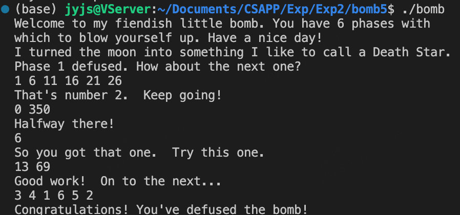

## Exp2 Bomb5

> SA25011052 刘睿博

## Phase1

```assembly
08048b80 <phase_1>:
 8048b80: 55                    push   %ebp
 8048b81: 89 e5                 mov    %esp,%ebp
 8048b83: 83 ec 08              sub    $0x8,%esp
 8048b86: c7 44 24 04 88 99 04  movl   $0x8049988,0x4(%esp)
 8048b8d: 08 
 8048b8e: 8b 45 08              mov    0x8(%ebp),%eax
 8048b91: 89 04 24              mov    %eax,(%esp)
 8048b94: e8 2a 05 00 00        call   80490c3 <strings_not_equal>
 8048b99: 85 c0                 test   %eax,%eax
 8048b9b: 74 05                 je     8048ba2 <phase_1+0x22>
 8048b9d: e8 e8 0a 00 00        call   804968a <explode_bomb>
 8048ba2: c9                    leave
 8048ba3: c3                    ret
```

可以看到是将输入的字符串与`0x8049988`处的字符串比较，使用gdb查看字符串得到

```rust
(gdb) x/s 0x8049988
0x8049988:      "I turned the moon into something I like to call a Death Star."
```

## Phase2

```assembly
08048ba4 <phase_2>:
 8048ba4: 55                    push   %ebp
 8048ba5: 89 e5                 mov    %esp,%ebp
 8048ba7: 83 ec 28              sub    $0x28,%esp
 8048baa: 8d 45 e4              lea    -0x1c(%ebp),%eax
 8048bad: 89 44 24 04           mov    %eax,0x4(%esp)
 8048bb1: 8b 45 08              mov    0x8(%ebp),%eax
 8048bb4: 89 04 24              mov    %eax,(%esp)
 8048bb7: e8 74 04 00 00        call   8049030 <read_six_numbers>
 8048bbc: c7 45 fc 01 00 00 00  movl   $0x1,-0x4(%ebp)
 8048bc3: eb 1e                 jmp    8048be3 <phase_2+0x3f>
 8048bc5: 8b 45 fc              mov    -0x4(%ebp),%eax
 8048bc8: 8b 54 85 e4           mov    -0x1c(%ebp,%eax,4),%edx
 8048bcc: 8b 45 fc              mov    -0x4(%ebp),%eax
 8048bcf: 48                    dec    %eax
 8048bd0: 8b 44 85 e4           mov    -0x1c(%ebp,%eax,4),%eax
 8048bd4: 83 c0 05              add    $0x5,%eax
 8048bd7: 39 c2                 cmp    %eax,%edx
 8048bd9: 74 05                 je     8048be0 <phase_2+0x3c>
 8048bdb: e8 aa 0a 00 00        call   804968a <explode_bomb>
 8048be0: ff 45 fc              incl   -0x4(%ebp)
 8048be3: 83 7d fc 05           cmpl   $0x5,-0x4(%ebp)
 8048be7: 7e dc                 jle    8048bc5 <phase_2+0x21>
 8048be9: c9                    leave
 8048bea: c3                    ret
```

从输入中读取六个数，并判断相邻两数之差是否为5

## Phase3

```assembly
08048beb <phase_3>:
 8048beb: 55                    push   %ebp
 8048bec: 89 e5                 mov    %esp,%ebp
 8048bee: 83 ec 28              sub    $0x28,%esp
 8048bf1: c7 45 f8 00 00 00 00  movl   $0x0,-0x8(%ebp)
 8048bf8: c7 45 fc 00 00 00 00  movl   $0x0,-0x4(%ebp)
 8048bff: 8d 45 f0              lea    -0x10(%ebp),%eax
 8048c02: 89 44 24 0c           mov    %eax,0xc(%esp)
 8048c06: 8d 45 f4              lea    -0xc(%ebp),%eax
 8048c09: 89 44 24 08           mov    %eax,0x8(%esp)
 8048c0d: c7 44 24 04 c6 99 04  movl   $0x80499c6,0x4(%esp)
 8048c14: 08 
 8048c15: 8b 45 08              mov    0x8(%ebp),%eax
 8048c18: 89 04 24              mov    %eax,(%esp)
 8048c1b: e8 48 fc ff ff        call   8048868 <sscanf@plt>
 8048c20: 89 45 fc              mov    %eax,-0x4(%ebp)
 8048c23: 83 7d fc 01           cmpl   $0x1,-0x4(%ebp)
 8048c27: 7f 05                 jg     8048c2e <phase_3+0x43>
 8048c29: e8 5c 0a 00 00        call   804968a <explode_bomb>
 8048c2e: 8b 45 f4              mov    -0xc(%ebp),%eax
 8048c31: 89 45 ec              mov    %eax,-0x14(%ebp)
 8048c34: 83 7d ec 07           cmpl   $0x7,-0x14(%ebp)
 8048c38: 77 54                 ja     8048c8e <phase_3+0xa3>
 8048c3a: 8b 55 ec              mov    -0x14(%ebp),%edx
 8048c3d: 8b 04 95 cc 99 04 08  mov    0x80499cc(,%edx,4),%eax
 8048c44: ff e0                 jmp    *%eax
 8048c46: c7 45 f8 5e 01 00 00  movl   $0x15e,-0x8(%ebp)
 8048c4d: eb 44                 jmp    8048c93 <phase_3+0xa8>
 8048c4f: c7 45 f8 f1 00 00 00  movl   $0xf1,-0x8(%ebp)
 8048c56: eb 3b                 jmp    8048c93 <phase_3+0xa8>
 8048c58: c7 45 f8 a4 01 00 00  movl   $0x1a4,-0x8(%ebp)
 8048c5f: eb 32                 jmp    8048c93 <phase_3+0xa8>
 8048c61: c7 45 f8 f2 02 00 00  movl   $0x2f2,-0x8(%ebp)
 8048c68: eb 29                 jmp    8048c93 <phase_3+0xa8>
 8048c6a: c7 45 f8 2e 02 00 00  movl   $0x22e,-0x8(%ebp)
 8048c71: eb 20                 jmp    8048c93 <phase_3+0xa8>
 8048c73: c7 45 f8 44 02 00 00  movl   $0x244,-0x8(%ebp)
 8048c7a: eb 17                 jmp    8048c93 <phase_3+0xa8>
 8048c7c: c7 45 f8 8d 03 00 00  movl   $0x38d,-0x8(%ebp)
 8048c83: eb 0e                 jmp    8048c93 <phase_3+0xa8>
 8048c85: c7 45 f8 c3 00 00 00  movl   $0xc3,-0x8(%ebp)
 8048c8c: eb 05                 jmp    8048c93 <phase_3+0xa8>
 8048c8e: e8 f7 09 00 00        call   804968a <explode_bomb>
 8048c93: 8b 45 f0              mov    -0x10(%ebp),%eax
 8048c96: 39 45 f8              cmp    %eax,-0x8(%ebp)
 8048c99: 74 05                 je     8048ca0 <phase_3+0xb5>
 8048c9b: e8 ea 09 00 00        call   804968a <explode_bomb>
 8048ca0: c9                    leave
 8048ca1: c3                    ret
```

首先通过scanf 读两个整数，第一个数作为switch 跳转表的id(0~7) 校验第二个数

## phase 4

```assembly
08048ca2 <func4>:
 8048ca2: 55                    push   %ebp
 8048ca3: 89 e5                 mov    %esp,%ebp
 8048ca5: 83 ec 08              sub    $0x8,%esp
 8048ca8: 83 7d 08 01           cmpl   $0x1,0x8(%ebp)
 8048cac: 7f 09                 jg     8048cb7 <func4+0x15>
 8048cae: c7 45 fc 01 00 00 00  movl   $0x1,-0x4(%ebp)
 8048cb5: eb 15                 jmp    8048ccc <func4+0x2a>
 8048cb7: 8b 45 08              mov    0x8(%ebp),%eax
 8048cba: 48                    dec    %eax
 8048cbb: 89 04 24              mov    %eax,(%esp)
 8048cbe: e8 df ff ff ff        call   8048ca2 <func4>
 8048cc3: 89 c2                 mov    %eax,%edx
 8048cc5: 0f af 55 08           imul   0x8(%ebp),%edx
 8048cc9: 89 55 fc              mov    %edx,-0x4(%ebp)
 8048ccc: 8b 45 fc              mov    -0x4(%ebp),%eax
 8048ccf: c9                    leave
 8048cd0: c3                    ret

08048cd1 <phase_4>:
 8048cd1: 55                    push   %ebp
 8048cd2: 89 e5                 mov    %esp,%ebp
 8048cd4: 83 ec 28              sub    $0x28,%esp
 8048cd7: 8d 45 f4              lea    -0xc(%ebp),%eax
 8048cda: 89 44 24 08           mov    %eax,0x8(%esp)
 8048cde: c7 44 24 04 ec 99 04  movl   $0x80499ec,0x4(%esp)
 8048ce5: 08 
 8048ce6: 8b 45 08              mov    0x8(%ebp),%eax
 8048ce9: 89 04 24              mov    %eax,(%esp)
 8048cec: e8 77 fb ff ff        call   8048868 <sscanf@plt>
 8048cf1: 89 45 fc              mov    %eax,-0x4(%ebp)
 8048cf4: 83 7d fc 01           cmpl   $0x1,-0x4(%ebp)
 8048cf8: 75 07                 jne    8048d01 <phase_4+0x30>
 8048cfa: 8b 45 f4              mov    -0xc(%ebp),%eax
 8048cfd: 85 c0                 test   %eax,%eax
 8048cff: 7f 05                 jg     8048d06 <phase_4+0x35>
 8048d01: e8 84 09 00 00        call   804968a <explode_bomb>
 8048d06: 8b 45 f4              mov    -0xc(%ebp),%eax
 8048d09: 89 04 24              mov    %eax,(%esp)
 8048d0c: e8 91 ff ff ff        call   8048ca2 <func4>
 8048d11: 89 45 f8              mov    %eax,-0x8(%ebp)
 8048d14: 81 7d f8 d0 02 00 00  cmpl   $0x2d0,-0x8(%ebp)
 8048d1b: 74 05                 je     8048d22 <phase_4+0x51>
 8048d1d: e8 68 09 00 00        call   804968a <explode_bomb>
 8048d22: c9                    leave
 8048d23: c3                    ret
```

func4是一个求阶乘函数，phase_4将输入求阶乘后与0x2d0做比较，即6!

## Phase5

```assembly
08048d24 <phase_5>:
 8048d24: 55                    push   %ebp
 8048d25: 89 e5                 mov    %esp,%ebp
 8048d27: 83 ec 38              sub    $0x38,%esp
 8048d2a: 8d 45 e8              lea    -0x18(%ebp),%eax
 8048d2d: 89 44 24 0c           mov    %eax,0xc(%esp)
 8048d31: 8d 45 ec              lea    -0x14(%ebp),%eax
 8048d34: 89 44 24 08           mov    %eax,0x8(%esp)
 8048d38: c7 44 24 04 c6 99 04  movl   $0x80499c6,0x4(%esp)
 8048d3f: 08 
 8048d40: 8b 45 08              mov    0x8(%ebp),%eax
 8048d43: 89 04 24              mov    %eax,(%esp)
 8048d46: e8 1d fb ff ff        call   8048868 <sscanf@plt>
 8048d4b: 89 45 fc              mov    %eax,-0x4(%ebp)
 8048d4e: 83 7d fc 01           cmpl   $0x1,-0x4(%ebp)
 8048d52: 7f 05                 jg     8048d59 <phase_5+0x35>
 8048d54: e8 31 09 00 00        call   804968a <explode_bomb>
 8048d59: 8b 45 ec              mov    -0x14(%ebp),%eax
 8048d5c: 83 e0 0f              and    $0xf,%eax
 8048d5f: 89 45 ec              mov    %eax,-0x14(%ebp)
 8048d62: 8b 45 ec              mov    -0x14(%ebp),%eax
 8048d65: 89 45 f8              mov    %eax,-0x8(%ebp)
 8048d68: c7 45 f0 00 00 00 00  movl   $0x0,-0x10(%ebp)
 8048d6f: c7 45 f4 00 00 00 00  movl   $0x0,-0xc(%ebp)
 8048d76: eb 16                 jmp    8048d8e <phase_5+0x6a>
 8048d78: ff 45 f0              incl   -0x10(%ebp)
 8048d7b: 8b 45 ec              mov    -0x14(%ebp),%eax
 8048d7e: 8b 04 85 c0 a5 04 08  mov    0x804a5c0(,%eax,4),%eax
 8048d85: 89 45 ec              mov    %eax,-0x14(%ebp)
 8048d88: 8b 45 ec              mov    -0x14(%ebp),%eax
 8048d8b: 01 45 f4              add    %eax,-0xc(%ebp)
 8048d8e: 8b 45 ec              mov    -0x14(%ebp),%eax
 8048d91: 83 f8 0f              cmp    $0xf,%eax
 8048d94: 75 e2                 jne    8048d78 <phase_5+0x54>
 8048d96: 83 7d f0 0a           cmpl   $0xa,-0x10(%ebp)
 8048d9a: 75 08                 jne    8048da4 <phase_5+0x80>
 8048d9c: 8b 45 e8              mov    -0x18(%ebp),%eax
 8048d9f: 39 45 f4              cmp    %eax,-0xc(%ebp)
 8048da2: 74 05                 je     8048da9 <phase_5+0x85>
 8048da4: e8 e1 08 00 00        call   804968a <explode_bomb>
 8048da9: c9                    leave
 8048daa: c3                    ret
```

读入两个数，按第一个数的低四个比特位作为起始状态依跳转表跳转直到为15，跳转表0～15为：`[10,2,14,7,8,12,15,11,0,4,1,13,3,9,6,5]` 从15反推起始状态应该是13。之后将 所有跳转状态的和 与 输入的第二个数字比较，应为69

## Phase6

```assembly
08048dab <phase_6>:
 8048dab: 55                    push   %ebp
 8048dac: 89 e5                 mov    %esp,%ebp
 8048dae: 83 ec 48              sub    $0x48,%esp
 8048db1: c7 45 f0 3c a6 04 08  movl   $0x804a63c,-0x10(%ebp)
 8048db8: 8d 45 d8              lea    -0x28(%ebp),%eax
 8048dbb: 89 44 24 04           mov    %eax,0x4(%esp)
 8048dbf: 8b 45 08              mov    0x8(%ebp),%eax
 8048dc2: 89 04 24              mov    %eax,(%esp)
 8048dc5: e8 66 02 00 00        call   8049030 <read_six_numbers>
 8048dca: c7 45 f8 00 00 00 00  movl   $0x0,-0x8(%ebp)
 8048dd1: eb 48                 jmp    8048e1b <phase_6+0x70>
 8048dd3: 8b 45 f8              mov    -0x8(%ebp),%eax
 8048dd6: 8b 44 85 d8           mov    -0x28(%ebp,%eax,4),%eax
 8048dda: 85 c0                 test   %eax,%eax
 8048ddc: 7e 0c                 jle    8048dea <phase_6+0x3f>
 8048dde: 8b 45 f8              mov    -0x8(%ebp),%eax
 8048de1: 8b 44 85 d8           mov    -0x28(%ebp,%eax,4),%eax
 8048de5: 83 f8 06              cmp    $0x6,%eax
 8048de8: 7e 05                 jle    8048def <phase_6+0x44>
 8048dea: e8 9b 08 00 00        call   804968a <explode_bomb>
 8048def: 8b 45 f8              mov    -0x8(%ebp),%eax
 8048df2: 40                    inc    %eax
 8048df3: 89 45 fc              mov    %eax,-0x4(%ebp)
 8048df6: eb 1a                 jmp    8048e12 <phase_6+0x67>
 8048df8: 8b 45 f8              mov    -0x8(%ebp),%eax
 8048dfb: 8b 54 85 d8           mov    -0x28(%ebp,%eax,4),%edx
 8048dff: 8b 45 fc              mov    -0x4(%ebp),%eax
 8048e02: 8b 44 85 d8           mov    -0x28(%ebp,%eax,4),%eax
 8048e06: 39 c2                 cmp    %eax,%edx
 8048e08: 75 05                 jne    8048e0f <phase_6+0x64>
 8048e0a: e8 7b 08 00 00        call   804968a <explode_bomb>
 8048e0f: ff 45 fc              incl   -0x4(%ebp)
 8048e12: 83 7d fc 05           cmpl   $0x5,-0x4(%ebp)
 8048e16: 7e e0                 jle    8048df8 <phase_6+0x4d>
 8048e18: ff 45 f8              incl   -0x8(%ebp)
 8048e1b: 83 7d f8 05           cmpl   $0x5,-0x8(%ebp)
 8048e1f: 7e b2                 jle    8048dd3 <phase_6+0x28>
 8048e21: c7 45 f8 00 00 00 00  movl   $0x0,-0x8(%ebp)
 8048e28: eb 34                 jmp    8048e5e <phase_6+0xb3>
 8048e2a: 8b 45 f0              mov    -0x10(%ebp),%eax
 8048e2d: 89 45 f4              mov    %eax,-0xc(%ebp)
 8048e30: c7 45 fc 01 00 00 00  movl   $0x1,-0x4(%ebp)
 8048e37: eb 0c                 jmp    8048e45 <phase_6+0x9a>
 8048e39: 8b 45 f4              mov    -0xc(%ebp),%eax
 8048e3c: 8b 40 08              mov    0x8(%eax),%eax
 8048e3f: 89 45 f4              mov    %eax,-0xc(%ebp)
 8048e42: ff 45 fc              incl   -0x4(%ebp)
 8048e45: 8b 45 f8              mov    -0x8(%ebp),%eax
 8048e48: 8b 44 85 d8           mov    -0x28(%ebp,%eax,4),%eax
 8048e4c: 3b 45 fc              cmp    -0x4(%ebp),%eax
 8048e4f: 7f e8                 jg     8048e39 <phase_6+0x8e>
 8048e51: 8b 55 f8              mov    -0x8(%ebp),%edx
 8048e54: 8b 45 f4              mov    -0xc(%ebp),%eax
 8048e57: 89 44 95 c0           mov    %eax,-0x40(%ebp,%edx,4)
 8048e5b: ff 45 f8              incl   -0x8(%ebp)
 8048e5e: 83 7d f8 05           cmpl   $0x5,-0x8(%ebp)
 8048e62: 7e c6                 jle    8048e2a <phase_6+0x7f>
 8048e64: 8b 45 c0              mov    -0x40(%ebp),%eax
 8048e67: 89 45 f0              mov    %eax,-0x10(%ebp)
 8048e6a: 8b 45 f0              mov    -0x10(%ebp),%eax
 8048e6d: 89 45 f4              mov    %eax,-0xc(%ebp)
 8048e70: c7 45 f8 01 00 00 00  movl   $0x1,-0x8(%ebp)
 8048e77: eb 19                 jmp    8048e92 <phase_6+0xe7>
 8048e79: 8b 45 f8              mov    -0x8(%ebp),%eax
 8048e7c: 8b 54 85 c0           mov    -0x40(%ebp,%eax,4),%edx
 8048e80: 8b 45 f4              mov    -0xc(%ebp),%eax
 8048e83: 89 50 08              mov    %edx,0x8(%eax)
 8048e86: 8b 45 f4              mov    -0xc(%ebp),%eax
 8048e89: 8b 40 08              mov    0x8(%eax),%eax
 8048e8c: 89 45 f4              mov    %eax,-0xc(%ebp)
 8048e8f: ff 45 f8              incl   -0x8(%ebp)
 8048e92: 83 7d f8 05           cmpl   $0x5,-0x8(%ebp)
 8048e96: 7e e1                 jle    8048e79 <phase_6+0xce>
 8048e98: 8b 45 f4              mov    -0xc(%ebp),%eax
 8048e9b: c7 40 08 00 00 00 00  movl   $0x0,0x8(%eax)
 8048ea2: 8b 45 f0              mov    -0x10(%ebp),%eax
 8048ea5: 89 45 f4              mov    %eax,-0xc(%ebp)
 8048ea8: c7 45 f8 00 00 00 00  movl   $0x0,-0x8(%ebp)
 8048eaf: eb 22                 jmp    8048ed3 <phase_6+0x128>
 8048eb1: 8b 45 f4              mov    -0xc(%ebp),%eax
 8048eb4: 8b 10                 mov    (%eax),%edx
 8048eb6: 8b 45 f4              mov    -0xc(%ebp),%eax
 8048eb9: 8b 40 08              mov    0x8(%eax),%eax
 8048ebc: 8b 00                 mov    (%eax),%eax
 8048ebe: 39 c2                 cmp    %eax,%edx
 8048ec0: 7d 05                 jge    8048ec7 <phase_6+0x11c>
 8048ec2: e8 c3 07 00 00        call   804968a <explode_bomb>
 8048ec7: 8b 45 f4              mov    -0xc(%ebp),%eax
 8048eca: 8b 40 08              mov    0x8(%eax),%eax
 8048ecd: 89 45 f4              mov    %eax,-0xc(%ebp)
 8048ed0: ff 45 f8              incl   -0x8(%ebp)
 8048ed3: 83 7d f8 04           cmpl   $0x4,-0x8(%ebp)
 8048ed7: 7e d8                 jle    8048eb1 <phase_6+0x106>
 8048ed9: c9                    leave
 8048eda: c3                    ret
```

从输入读取六个数，检测是否是1～6的一个排列，按照数字的顺序将`0x0804a63c`处的链表重新排列，再检验新链表是否是降序的。
查看原链表得到：

```assembly
objdump -S -j .data --start-address=0x804a600 --stop-address=0x804a648 bomb

bomb:     file format elf32-i386


Disassembly of section .data:

0804a600 <node6>:
 804a600:       7f 01 00 00 06 00 00 00 00 00 00 00                 ............

0804a60c <node5>:
 804a60c:       75 00 00 00 05 00 00 00 00 a6 04 08                 u...........

0804a618 <node4>:
 804a618:       4d 03 00 00 04 00 00 00 0c a6 04 08                 M...........

0804a624 <node3>:
 804a624:       e4 03 00 00 03 00 00 00 18 a6 04 08                 ............

0804a630 <node2>:
 804a630:       65 00 00 00 02 00 00 00 24 a6 04 08                 e.......$...

0804a63c <node1>:
 804a63c:       c8 02 00 00 01 00 00 00 30 a6 04 08                 ........0...
```

结构体{value, idx, next}的value降序排列应为：`3 4 1 6 5 2`

