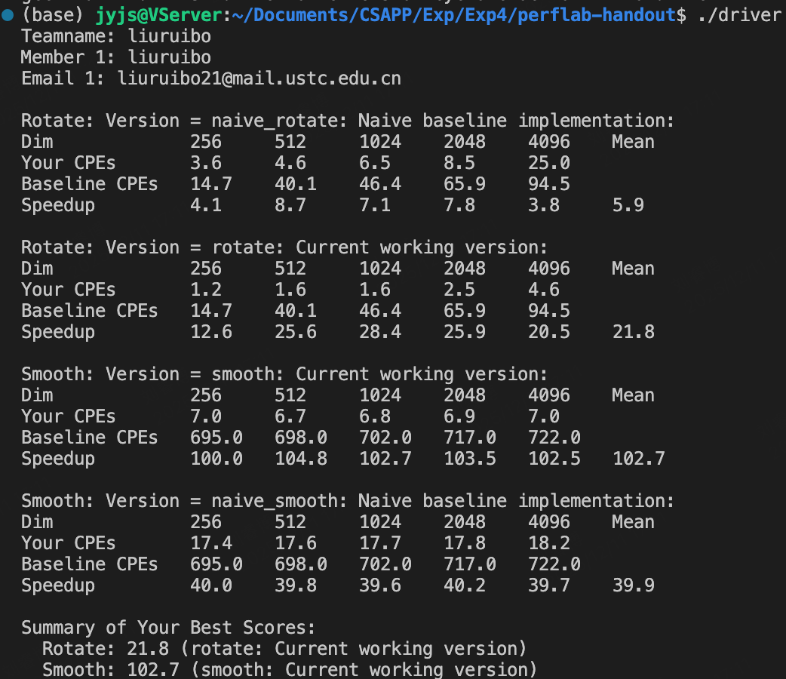

# Exp4

> SA25011052 刘睿博

## Rotate

```C
void rotate(int dim, pixel *src, pixel *dst) 
{
    int stride = 8;
    for(int i = 0; i < dim; i+=stride) {
        for(int j = 0; j < dim; j+= stride) {
            for(int k = i; k < i+stride; k++) {
                dst[RIDX(dim-1-j, k, dim)] = src[RIDX(k, j+0, dim)];
                dst[RIDX(dim-2-j, k, dim)] = src[RIDX(k, j+1, dim)];
                dst[RIDX(dim-3-j, k, dim)] = src[RIDX(k, j+2, dim)];
                dst[RIDX(dim-4-j, k, dim)] = src[RIDX(k, j+3, dim)];
                dst[RIDX(dim-5-j, k, dim)] = src[RIDX(k, j+4, dim)];
                dst[RIDX(dim-6-j, k, dim)] = src[RIDX(k, j+5, dim)];
                dst[RIDX(dim-7-j, k, dim)] = src[RIDX(k, j+6, dim)];
                dst[RIDX(dim-8-j, k, dim)] = src[RIDX(k, j+7, dim)];
            }
        }
    }
}
```

使用循环展开，对8*8的小矩阵进行操作

## Smooth

```C
void smooth(int dim, pixel *src, pixel *dst) 
{
    for(int i = 1; i < dim; i++) {
        // top edge
        dst[RIDX(i, 0, dim)].blue = (src[RIDX(i-1, 0, dim)].blue + src[RIDX(i-1, 1, dim)].blue +
                                src[RIDX(i, 0, dim)].blue + src[RIDX(i, 1, dim)].blue +
                                src[RIDX(i+1, 0, dim)].blue + src[RIDX(i+1, 1, dim)].blue) / 6;
        dst[RIDX(i, 0, dim)].green = (src[RIDX(i-1, 0, dim)].green + src[RIDX(i-1, 1, dim)].green +
                                src[RIDX(i, 0, dim)].green + src[RIDX(i, 1, dim)].green +
                                src[RIDX(i+1, 0, dim)].green + src[RIDX(i+1, 1, dim)].green) / 6;
        dst[RIDX(i, 0, dim)].red = (src[RIDX(i-1, 0, dim)].red + src[RIDX(i-1, 1, dim)].red +
                                src[RIDX(i, 0, dim)].red + src[RIDX(i, 1, dim)].red +
                                src[RIDX(i+1, 0, dim)].red + src[RIDX(i+1, 1, dim)].red) / 6;
        // bottom edge
        dst[RIDX(i, dim-1, dim)].blue = (src[RIDX(i-1, dim-2, dim)].blue + src[RIDX(i-1, dim-1, dim)].blue +
                                src[RIDX(i, dim-2, dim)].blue + src[RIDX(i, dim-1, dim)].blue +
                                src[RIDX(i+1, dim-2, dim)].blue + src[RIDX(i+1, dim-1, dim)].blue) / 6;
        dst[RIDX(i, dim-1, dim)].green = (src[RIDX(i-1, dim-2, dim)].green + src[RIDX(i-1, dim-1, dim)].green +
                                src[RIDX(i, dim-2, dim)].green + src[RIDX(i, dim-1, dim)].green +
                                src[RIDX(i+1, dim-2, dim)].green + src[RIDX(i+1, dim-1, dim)].green) / 6;
        dst[RIDX(i, dim-1, dim)].red = (src[RIDX(i-1, dim-2, dim)].red + src[RIDX(i-1, dim-1, dim)].red +
                                src[RIDX(i, dim-2, dim)].red + src[RIDX(i, dim-1, dim)].red +
                                src[RIDX(i+1, dim-2, dim)].red + src[RIDX(i+1, dim-1, dim)].red) / 6;

        // left edge
        dst[RIDX(0, i, dim)].blue = (src[RIDX(0, i-1, dim)].blue + src[RIDX(0, i, dim)].blue +
                                src[RIDX(1, i-1, dim)].blue + src[RIDX(1, i, dim)].blue +
                                src[RIDX(0, i+1, dim)].blue + src[RIDX(1, i+1, dim)].blue) / 6;
        dst[RIDX(0, i, dim)].green = (src[RIDX(0, i-1, dim)].green + src[RIDX(0, i, dim)].green +
                                src[RIDX(1, i-1, dim)].green + src[RIDX(1, i, dim)].green +
                                src[RIDX(0, i+1, dim)].green + src[RIDX(1, i+1, dim)].green) / 6;
        dst[RIDX(0, i, dim)].red = (src[RIDX(0, i-1, dim)].red + src[RIDX(0, i, dim)].red +
                                src[RIDX(1, i-1, dim)].red + src[RIDX(1, i, dim)].red +
                                src[RIDX(0, i+1, dim)].red + src[RIDX(1, i+1, dim)].red) / 6;
        // right edge
        dst[RIDX(dim-1, i, dim)].blue = (src[RIDX(dim-2, i-1, dim)].blue + src[RIDX(dim-2, i, dim)].blue +
                                src[RIDX(dim-1, i-1, dim)].blue + src[RIDX(dim-1, i, dim)].blue +
                                src[RIDX(dim-2, i+1, dim)].blue + src[RIDX(dim-1, i+1, dim)].blue) / 6;
        dst[RIDX(dim-1, i, dim)].green = (src[RIDX(dim-2, i-1, dim)].green + src[RIDX(dim-2, i, dim)].green +
                                src[RIDX(dim-1, i-1, dim)].green + src[RIDX(dim-1, i, dim)].green +
                                src[RIDX(dim-2, i+1, dim)].green + src[RIDX(dim-1, i+1, dim)].green) / 6;
        dst[RIDX(dim-1, i, dim)].red = (src[RIDX(dim-2, i-1, dim)].red + src[RIDX(dim-2, i, dim)].red +
                                src[RIDX(dim-1, i-1, dim)].red + src[RIDX(dim-1, i, dim)].red +
                                src[RIDX(dim-2, i+1, dim)].red + src[RIDX(dim-1, i+1, dim)].red) / 6;
    }
    // four corners
    dst[RIDX(0, 0, dim)].blue = (src[RIDX(0, 0, dim)].blue + src[RIDX(0, 1, dim)].blue +
                            src[RIDX(1, 0, dim)].blue + src[RIDX(1, 1, dim)].blue) / 4;
    dst[RIDX(0, 0, dim)].green = (src[RIDX(0, 0, dim)].green + src[RIDX(0, 1, dim)].green +
                            src[RIDX(1, 0, dim)].green + src[RIDX(1, 1, dim)].green) / 4;
    dst[RIDX(0, 0, dim)].red = (src[RIDX(0, 0, dim)].red + src[RIDX(0, 1, dim)].red +
                            src[RIDX(1, 0, dim)].red + src[RIDX(1, 1, dim)].red) / 4;
    dst[RIDX(0, dim-1, dim)].blue = (src[RIDX(0, dim-2, dim)].blue + src[RIDX(0, dim-1, dim)].blue +
                            src[RIDX(1, dim-2, dim)].blue + src[RIDX(1, dim-1, dim)].blue) / 4;
    dst[RIDX(0, dim-1, dim)].green = (src[RIDX(0, dim-2, dim)].green + src[RIDX(0, dim-1, dim)].green +
                            src[RIDX(1, dim-2, dim)].green + src[RIDX(1, dim-1, dim)].green) / 4;
    dst[RIDX(0, dim-1, dim)].red = (src[RIDX(0, dim-2, dim)].red + src[RIDX(0, dim-1, dim)].red +
                            src[RIDX(1, dim-2, dim)].red + src[RIDX(1, dim-1, dim)].red) / 4;
    dst[RIDX(dim-1, 0, dim)].blue = (src[RIDX(dim-2, 0, dim)].blue + src[RIDX(dim-2, 1, dim)].blue +
                            src[RIDX(dim-1, 0, dim)].blue + src[RIDX(dim-1, 1, dim)].blue) / 4;
    dst[RIDX(dim-1, 0, dim)].green = (src[RIDX(dim-2, 0, dim)].green + src[RIDX(dim-2, 1, dim)].green +
                            src[RIDX(dim-1, 0, dim)].green + src[RIDX(dim-1, 1, dim)].green) / 4;
    dst[RIDX(dim-1, 0, dim)].red = (src[RIDX(dim-2, 0, dim)].red + src[RIDX(dim-2, 1, dim)].red +
                            src[RIDX(dim-1, 0, dim)].red + src[RIDX(dim-1, 1, dim)].red) / 4;
    dst[RIDX(dim-1, dim-1, dim)].blue = (src[RIDX(dim-2, dim-2, dim)].blue + src[RIDX(dim-2, dim-1, dim)].blue +
                            src[RIDX(dim-1, dim-2, dim)].blue + src[RIDX(dim-1, dim-1, dim)].blue) / 4;
    dst[RIDX(dim-1, dim-1, dim)].green = (src[RIDX(dim-2, dim-2, dim)].green + src[RIDX(dim-2, dim-1, dim)].green +
                            src[RIDX(dim-1, dim-2, dim)].green + src[RIDX(dim-1, dim-1, dim)].green) / 4;
    dst[RIDX(dim-1, dim-1, dim)].red = (src[RIDX(dim-2, dim-2, dim)].red + src[RIDX(dim-2, dim-1, dim)].red +
                            src[RIDX(dim-1, dim-2, dim)].red + src[RIDX(dim-1, dim-1, dim)].red) / 4;
    // center area
    for(int i = 1; i < dim-1; i++) {
        for(int j = 1; j < dim-1; j++) {
            dst[RIDX(i, j, dim)].blue = (src[RIDX(i-1, j-1, dim)].blue + src[RIDX(i-1, j, dim)].blue + src[RIDX(i-1, j+1, dim)].blue +
                                    src[RIDX(i, j-1, dim)].blue + src[RIDX(i, j, dim)].blue + src[RIDX(i, j+1, dim)].blue +
                                    src[RIDX(i+1, j-1, dim)].blue + src[RIDX(i+1, j, dim)].blue + src[RIDX(i+1, j+1, dim)].blue) / 9;
            dst[RIDX(i, j, dim)].green = (src[RIDX(i-1, j-1, dim)].green + src[RIDX(i-1, j, dim)].green + src[RIDX(i-1, j+1, dim)].green +
                                    src[RIDX(i, j-1, dim)].green + src[RIDX(i, j, dim)].green + src[RIDX(i, j+1, dim)].green +
                                    src[RIDX(i+1, j-1, dim)].green + src[RIDX(i+1, j, dim)].green + src[RIDX(i+1, j+1, dim)].green) / 9;
            dst[RIDX(i, j, dim)].red = (src[RIDX(i-1, j-1, dim)].red + src[RIDX(i-1, j, dim)].red + src[RIDX(i-1, j+1, dim)].red +
                                    src[RIDX(i, j-1, dim)].red + src[RIDX(i, j, dim)].red + src[RIDX(i, j+1, dim)].red +
                                    src[RIDX(i+1, j-1, dim)].red + src[RIDX(i+1, j, dim)].red + src[RIDX(i+1, j+1, dim)].red) / 9;
        }
    }
}
```

对边角进行平滑处理后再处理中间部分，可以省去边界判断


