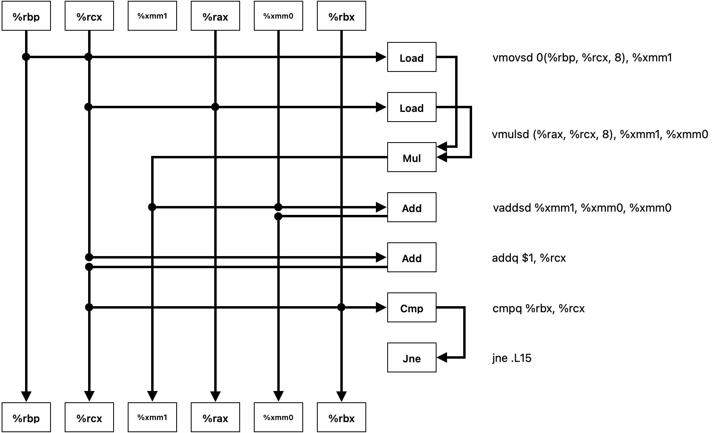
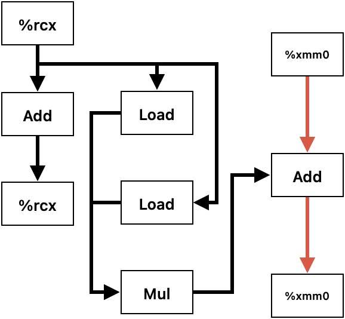

# HW3

> SA25011052 刘睿博

## 5.13

A. 





标红部分为关键路径，由于乘法操作较慢，依赖其结果的加法操作是关键路径

B. 3

C. 1

D. 因为关键路径上仅有浮点加法

---

## 5.17

```C
void *_memset(void *s, unsigned long c, size_t n) {
    size_t K = sizeof(unsigned long);
    size_t processed = 0;
    unsigned char *ptr = (unsigned char *)s;


    while (((size_t)ptr % K) && (processed < n)) {
        *ptr++ = (unsigned char)c;
        processed++;
    }

    unsigned long *word_ptr = (unsigned long *)ptr;
    size_t remaining = n - processed;
    size_t word_count = remaining / K;
    size_t tail = remaining % K;

    for (size_t i = 0; i < word_count; i++) {
        *word_ptr++ = c;
    }

    ptr = (unsigned char *)word_ptr;
    for (size_t i = 0; i < tail; i++) {
        *ptr++ = (unsigned char)c;
    }

    return s;
}
```


